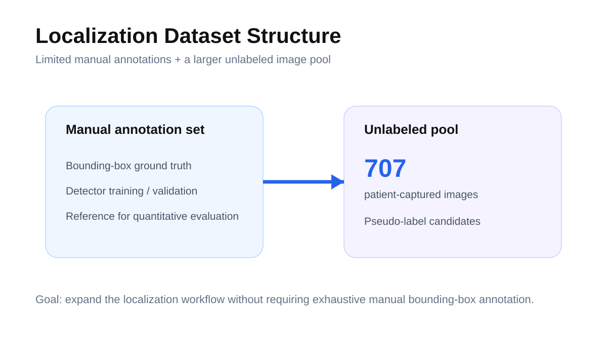
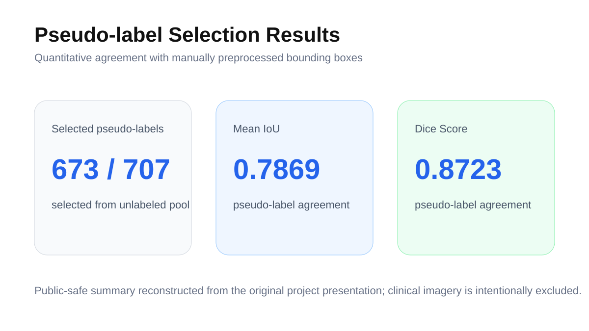
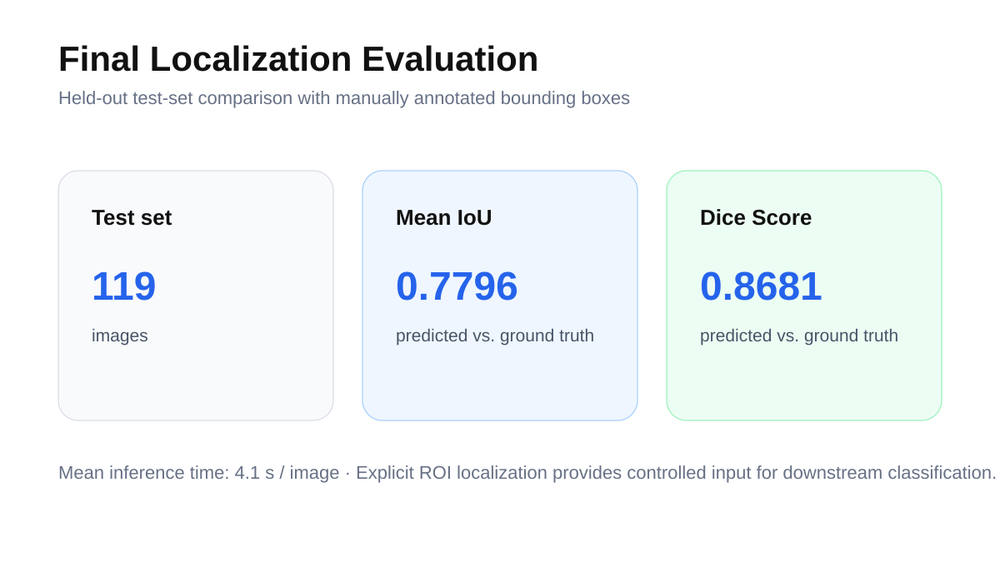

# Weakly & Semi-Supervised Lesion Localization in Smartphone-Captured Stoma Images

> A data-efficient localization pipeline for extracting lesion regions from non-standardized patient-captured smartphone images.

**Period:** Feb. 2026 - Jun. 2026  
**Affiliation:** Machine Learning & Data Mining Laboratory, Ajou University  
**Project:** Industry-Academic Collaborative Research Project  
**Core methods:** Faster R-CNN · WSOL · saliency-guided pseudo-label selection

---

## Overview

Remote stoma care depends on images captured by patients in heterogeneous real-world conditions. Lighting, distance, angle, background, and image quality vary considerably, while detailed bounding-box annotation is expensive. This project developed an automated lesion-localization workflow that combines a detector with annotation-efficient learning strategies.

## Problem

The central problem was to obtain a stable lesion ROI before downstream condition classification while reducing dependence on exhaustive manual bounding-box annotation.

## Method

1. Train a **Faster R-CNN** detector with the available manually labeled bounding boxes.
2. Run the detector over the larger unlabeled image set to generate pseudo-label candidates.
3. Explore **weakly supervised object localization (WSOL)** and saliency-guided selection to filter pseudo-labels.
4. Use selected pseudo-labels to expand the training workflow.
5. Evaluate predicted regions against manually annotated bounding boxes using IoU and Dice Score.

## Quantitative results

### Pseudo-label selection

- **673 / 707** unlabeled images were selected as pseudo-labels in the reported selection stage.
- Mean pseudo-label agreement with manual preprocessing: **IoU 0.7869**, **Dice Score 0.8723**.

### Test-set localization

| Metric | Result |
|---|---:|
| Test-set size | 119 images |
| Mean IoU | **0.7796** |
| Dice Score | **0.8681** |
| Mean inference time | 4.1 s / image |

## My contribution

- Detector training and evaluation
- Experimental pipeline implementation
- Exploration of WSOL / semi-supervised localization strategies
- Pseudo-label selection and quantitative evaluation
- End-to-end preprocessing-to-evaluation workflow

## Research significance

The project separates **where the clinically relevant region is** from the downstream prediction problem. Explicit ROI extraction gives later classification stages a more controlled visual input and provides a practical route for learning from limited manual annotations.

## Project outputs

- [`outputs/localization-public-technical-excerpt.pdf`](outputs/localization-public-technical-excerpt.pdf) - curated public technical excerpt containing the non-clinical methodology and quantitative results.
- [`outputs/PROJECT_OUTPUTS.md`](outputs/PROJECT_OUTPUTS.md) - source manifest, evidence notes, and public-release scope.
- The original full presentation is **not redistributed publicly** because it contains clinical images.

## Data & privacy

No original patient-captured stoma images are included in this repository. The displayed diagrams are public-safe reconstructions derived from the project materials; the excerpt PDF was curated specifically to avoid redistributing clinical imagery.

---

**Junha Won** · Ajou University  
[Portfolio](https://juna0926.github.io/Portfolio/) · [GitHub](https://github.com/Juna0926)
